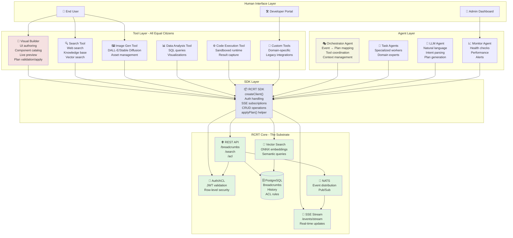

## RCRT – Right Context, Right Time

> **✨ Fully Portable**: Supports custom container prefixes for multi-deployment environments.

**Quick Start**: 
```bash
git clone <repo> && cd breadcrums && ./setup.sh

# With custom prefix (for forked repos or multi-deployment):
PROJECT_PREFIX="lightforge-" ./setup.sh
```
→ Visit http://localhost:8082 → Install browser extension

Works on Mac (Intel & Apple Silicon), Linux, and Windows - automatically detects your platform!

RCRT is a production‑grade system for delivering the right context to agents at the right time using minimal, persistent context packets called breadcrumbs. It provides CRUD APIs, real‑time events, vector search, fine‑grained access control (RLS + ACL), and secure secret management. No mocks or hidden fallbacks – all components are real and deployable.

### What it does
- **Breadcrumbs**: Minimal JSON packets that agents can create, update, read, and subscribe to.
- **Two views**: A minimal context view for LLMs and a full operational view for privileged agents.
- **Eventing**: Notifies subscribers on updates via NATS JetStream, SSE, and webhooks.
- **Access control**: JWT auth, tenant isolation via RLS, per‑breadcrumb ACLs, and roles (emitter, subscriber, curator).
- **Vector search**: `pgvector` embeddings with local ONNX by default for semantic search.
- **Secrets**: Envelope encryption service with audited decrypts and rotation support.
- **Deployability**: Single binary service, Docker/Compose, and Helm chart.

### How it works (high level)
- The service is built in Rust (Axum + Tokio). Business logic lives in `rcrt-core`; the HTTP/SSE service is `rcrt-server`.
- Data is stored in PostgreSQL with `pgvector`; `context` lives in JSONB and embeddings in a vector column.
- Events are produced to NATS JetStream and fanned out to SSE clients and registered webhooks with HMAC signatures and retries (DLQ on failure).
- Row‑Level Security (RLS) isolates tenants; ACLs enable cross‑tenant sharing per breadcrumb action.
- The embedding provider defaults to an embedded ONNX model (MiniLM L6 v2, 384d), configurable via env.
- Envelope encryption secures secrets (DEK per secret, wrapped by KEK), with an audit log for decrypt accesses.

### Complete Setup Experience

RCRT provides a seamless setup experience:

1. **Run `./setup.sh`** - Automatically builds everything including the browser extension
2. **Visit Dashboard** at http://localhost:8082 - First-run wizard guides OpenRouter setup
3. **Install Extension** with `./install-extension.sh` - Chat interface in your browser
4. **Start Building** - Create agents, use tools, and build AI-powered workflows

### RCRT Agentic Ecosystem

RCRT serves as the foundation for a complete agentic system where tools, agents, and UIs interact through a unified interface. The Visual Builder (`rcrt-visual-builder/`) demonstrates this by implementing live UI updates via breadcrumb schemas.



**Key insight**: The Visual Builder is just one tool among many. From RCRT's perspective, all tools are authenticated clients that speak breadcrumbs. This creates a truly composable system where LLM agents can coordinate any combination of tools seamlessly.

### SDK Architecture Guide

RCRT provides **multiple specialized SDK packages** that work together. Here's when to use each:

#### **1. Core SDK (`packages/sdk/`)**
**Purpose**: Basic RCRT operations - your starting point  
**Use for**: Simple breadcrumb CRUD, search, auth, SSE  
**Key class**: `RcrtClientEnhanced`

```typescript
import { RcrtClientEnhanced } from '@rcrt-builder/sdk';

const client = new RcrtClientEnhanced('http://localhost:8080');
await client.createBreadcrumb({ title: 'Test', context: {}, tags: ['demo'] });
const results = await client.searchBreadcrumbs({ tag: 'demo' });
```

#### **2. Tools SDK (`packages/tools/`)**
**Purpose**: Tool registration, discovery, execution  
**Use for**: Building tools that integrate with RCRT  
**Key classes**: `ToolRegistry`, `RCRTToolWrapper`

```typescript
import { createToolRegistry } from '@rcrt-builder/tools';

const registry = await createToolRegistry(client, 'workspace:demo', {
  enableBuiltins: true,    // echo, timer, random
  enableLangChain: true    // calculator, web_browser
});
```

#### **3. Runtime SDK (`packages/runtime/`)**
**Purpose**: Orchestrate AI agents and workflows  
**Use for**: Building autonomous agents, flow execution  
**Key classes**: `AgentExecutor`, `FlowExecutor`, `RuntimeManager`

```typescript
import { RuntimeManager } from '@rcrt-builder/runtime';

const runtime = new RuntimeManager({
  rcrtUrl: 'http://localhost:8080',
  workspace: 'workspace:agents',
  openRouterApiKey: 'your-key'
});
await runtime.start();
```

#### **4. Node SDK (`packages/node-sdk/`)**
**Purpose**: Build custom processing nodes  
**Use for**: Creating reusable workflow components  
**Key classes**: `BaseNode`, `NodeRegistry`

```typescript
import { BaseNode, RegisterNode } from '@rcrt-builder/node-sdk';

@RegisterNode({
  schema_name: 'node.template.v1',
  title: 'My Custom Node',
  tags: ['node:template', 'custom'],
  context: { node_type: 'custom', category: 'processing' }
})
class CustomNode extends BaseNode {
  // Implementation
}
```

#### **Package Dependencies**
```
Runtime SDK → Tools SDK → Core SDK
Node SDK → Core SDK
All packages → @rcrt-builder/core (shared types)
```

#### **File Locations Quick Reference**
| SDK Package | Main Entry | Registry/Manager | Config |
|-------------|------------|------------------|---------|
| **Core** | `rcrt-visual-builder/packages/sdk/src/index.ts` | - | - |
| **Tools** | `rcrt-visual-builder/packages/tools/src/index.ts` | `src/registry.ts` | `src/langchain.ts` |
| **Runtime** | `rcrt-visual-builder/packages/runtime/src/index.ts` | `src/runtime-manager.ts` | agent/flow executors |
| **Node** | `rcrt-visual-builder/packages/node-sdk/src/index.ts` | `src/registry.ts` | `src/dev-server.ts` |

#### **When to Use Which SDK**

- **Building a simple app?** → Start with **Core SDK**
- **Need tools (search, calc, etc.)?** → Add **Tools SDK** 
- **Want autonomous agents?** → Use **Runtime SDK**
- **Building custom workflow nodes?** → Use **Node SDK**
- **Full agentic system?** → Combine **Tools + Runtime SDKs**

### Core Architecture Principle

**Agents = Data + Subscriptions**  
**Tools = Code**

This fundamental distinction drives RCRT's power:
- **Agents**: Behavior emerges from prompt breadcrumbs and context subscriptions (data-driven)
- **Tools**: Capabilities come from API integrations and processing logic (code-driven)
- **Result**: Infinite agent specializations with minimal tool implementations

### Key concepts
- **Breadcrumb**: Minimal, persistent JSON context packet optimized for LLMs/automations.
- **Roles**:
  - Emitter: create/update
  - Subscriber: receive updates (by ID or selector)
  - Curator: manage metadata/ACLs/subscriptions/tenants and admin ops
- **Views**:
  - Context view: redacted/minimal for LLM usage
  - Full view: privileged operational metadata
- **Selectors**: Tag/schema/context‑path rules that match breadcrumbs for event subscriptions.

### Quick start (local)
Prereqs: Docker and Docker Compose.

```bash
# Optional: Enable secrets service
echo 'LOCAL_KEK_BASE64="'$(openssl rand -base64 32)'"' >> .env

docker compose up --build -d
```

- API base: `http://localhost:8081`
- Health: `GET /health`
- Docs: Redoc `/docs`, Swagger `/swagger`, raw spec `/openapi.json`
- Secrets: Requires `LOCAL_KEK_BASE64` in `.env` for encryption

Register a tenant/agent and a webhook (see more in `docs/Integration_Guide.md`):

```bash
export OWNER_ID=$(uuidgen)
export AGENT_ID=$(uuidgen)
curl -X POST http://localhost:8081/tenants/$OWNER_ID -H 'Content-Type: application/json' -d '{"name":"local"}'
curl -X POST http://localhost:8081/agents/$AGENT_ID -H 'Content-Type: application/json' -d '{"roles":["curator","emitter","subscriber"]}'
curl -X POST http://localhost:8081/agents/$AGENT_ID/webhooks -H 'Content-Type: application/json' -d '{"url":"http://host.docker.internal:8082/webhook"}'
```

Create a breadcrumb:

```bash
curl -X POST http://localhost:8081/breadcrumbs \
  -H 'Content-Type: application/json' \
  -H "Idempotency-Key: ikey-$(date +%s)" \
  -d '{
    "title":"Travel Dates",
    "context":{"start_date":"2025-10-20","end_date":"2025-10-28","timezone":"Europe/London"},
    "tags":["travel","dates"],
    "schema_name":"travel.dates.v1","visibility":"team","sensitivity":"low"
  }'
```

Read/list/search:

```bash
curl http://localhost:8081/breadcrumbs/<id>
curl http://localhost:8081/breadcrumbs/<id>/full
curl http://localhost:8081/breadcrumbs/<id>/history
curl http://localhost:8081/breadcrumbs?tag=travel
curl "http://localhost:8081/breadcrumbs/search?q=Europe%2FLondon&nn=5"
```

SSE events:

```bash
curl -N --http1.1 -H 'Accept: text/event-stream' http://localhost:8081/events/stream
```

### API surface
OpenAPI 3.0 is published at `docs/openapi.json` and served at `GET /openapi.json` with UI at `/docs` and `/swagger`.
Endpoints include breadcrumbs CRUD, history, vector search, selector subscriptions, events stream, webhooks management, secrets, DLQ ops, and admin purge. See the online docs for detailed schemas, parameters, and response bodies.

### Security and access control
- **Auth**: JWT (RS256/EdDSA) with claims `sub` (agent), `owner_id`, and `roles[]`. Dev mode can disable auth (`AUTH_MODE=disabled`).
- **Isolation**: PostgreSQL RLS enforces tenant isolation via `app.current_owner_id`/`app.current_agent_id`.
- **ACLs**: Per‑breadcrumb actions: `read_context`, `read_full`, `update`, `delete`, `subscribe`. Enables cross‑tenant sharing.
- **Webhooks**: HMAC signatures via per‑agent secret; retries with backoff; DLQ for failures.
- **Secrets**: Native encryption service using envelope encryption (AES-256-GCM data + XChaCha20-Poly1305 key wrapping). Full CRUD operations, audited decrypts, rotation support. Set `LOCAL_KEK_BASE64` env var.

### Embeddings and vector search
- Default: local ONNX MiniLM L6 v2 (384d). Configurable provider/dimension.
- Search via `GET /breadcrumbs/search` with `q` (auto‑embed) or `qvec` (explicit).

### Configuration (env)
- Common environment variables:
- **Database/Bus**: `DB_URL`, `NATS_URL`
- **Auth**: `AUTH_MODE=jwt|disabled`, `JWT_ISSUER`, `JWT_AUDIENCE`, `JWT_JWKS_URL`
- **Embeddings**: `EMBED_DIM=384`, `EMBED_MODEL`, `EMBED_TOKENIZER`
- **Secrets**: `LOCAL_KEK_BASE64`
- **Owner/Agent**: `OWNER_ID`, `AGENT_ID`

### Deployment
- **Docker**: Multi‑stage builds produce a static binary image; see `Dockerfile`.
- **Compose (local)**: Postgres + NATS + service; see `docker-compose.yml`.
- **Kubernetes**: Helm chart under `helm/rcrt/` with configurable values for DB/NATS/auth/embeddings and probes.

### Development
If you have Rust locally, you can build the workspace:

```bash
cargo build --workspace
```

Alternatively, use Docker/Compose for a consistent environment.

### Observability
- Prometheus metrics at `GET /metrics` (request counts, latency histograms, webhook delivery histograms).
- Structured JSON logs with request IDs.
- Tracing hooks prepared for OpenTelemetry.

### Troubleshooting
- Docs not loading: ensure `docs/openapi.json` is valid JSON and refresh `/swagger`.
- 500 on agent/webhook upsert: ensure tenant exists (`POST /tenants/:id`).
- SSE pings stop: ensure you run the latest image; message loops are isolated from the async runtime.
- Webhook 4xx/5xx: check HMAC secret and delivery endpoint; inspect DLQ via `GET /dlq`.

### Visual Builder Demo
The Visual Builder (`rcrt-visual-builder/`) showcases RCRT's capabilities with a live agentic demo:

```bash
# Start RCRT backend
docker compose up -d --build

# Start Visual Builder
cd rcrt-visual-builder/apps/builder
pnpm dev

# Open demo
open http://localhost:3000/agentic-demo
```

Click "Seed Agentic Demo" → "Gaming" to see live UI updates via SSE as agents react to events and apply UI plans.

### Documentation

**Start Here:**
- **[Quick Start Guide](QUICK_START.md)** - Get running in minutes
- **[System Architecture](docs/SYSTEM_ARCHITECTURE.md)** ⭐ Complete system design
- **[RCRT Principles](docs/RCRT_PRINCIPLES.md)** - Core philosophy

**Reference:**
- **[API Quick Reference](docs/QUICK_REFERENCE.md)** - API cheatsheet
- **[Deployment Guide](docs/DEPLOYMENT.md)** - Setup and deployment
- **[Changelog](CHANGELOG.md)** - Version history

**Component-Specific:**
- **[Browser Extension](rcrt-extension-v2/README.md)** - Extension docs
- **[Visual Builder](rcrt-visual-builder/README.md)** - Builder docs
- **[Desktop Build](desktop-build/README.md)** - Desktop deployment

### 3-agent chain smoke test (Supervisor ↔ Researcher ↔ Synthesizer)

This demonstrates agents coordinating only via breadcrumbs and events (no side channels):

1) Create three agents and basic selectors
```
export OWNER_ID=${OWNER_ID:-$(uuidgen)}
export SUP_ID=${SUP_ID:-$(uuidgen)}
export RES_ID=${RES_ID:-$(uuidgen)}
export SYN_ID=${SYN_ID:-$(uuidgen)}

curl -X POST http://localhost:8081/tenants/$OWNER_ID -H 'Content-Type: application/json' -d '{"name":"local"}'
curl -X POST http://localhost:8081/agents/$SUP_ID -H 'Content-Type: application/json' -d '{"roles":["curator","subscriber","emitter"]}'
curl -X POST http://localhost:8081/agents/$RES_ID -H 'Content-Type: application/json' -d '{"roles":["subscriber","emitter"]}'
curl -X POST http://localhost:8081/agents/$SYN_ID -H 'Content-Type: application/json' -d '{"roles":["subscriber","emitter"]}'

# Supervisor watches user channel and completions
curl -X POST http://localhost:8081/subscriptions/selectors -H 'Content-Type: application/json' -d '{
  "any_tags":["user_message","research_done","synthesis_done"]
}'
# Researcher watches research tasks
curl -X POST http://localhost:8081/subscriptions/selectors -H 'Content-Type: application/json' -d '{
  "any_tags":["research_task"]
}'
# Synthesizer watches synthesis tasks
curl -X POST http://localhost:8081/subscriptions/selectors -H 'Content-Type: application/json' -d '{
  "any_tags":["synthesis_task"]
}'
```

2) Run three SSE listeners (Node.js)

Supervisor:
```javascript
// supervisor_sse.js
import EventSource from 'eventsource';
import fetch from 'node-fetch';
const BASE = process.env.RCRT_URL || 'http://localhost:8081';
const es = new EventSource(`${BASE}/events/stream`, { headers: { Accept: 'text/event-stream' } });
let lastUser = null;
es.onmessage = async (m) => {
  const evt = JSON.parse(m.data);
  if (evt.type !== 'breadcrumb.updated') return;
  const bc = await fetch(`${BASE}/breadcrumbs/${evt.breadcrumb_id}`).then(r=>r.json());
  const tags = bc.tags || [];
  if (tags.includes('user_message')) {
    lastUser = bc;
    await fetch(`${BASE}/breadcrumbs`, { method: 'POST', headers: { 'Content-Type':'application/json' }, body: JSON.stringify({ title:'Research task', context:{ query: bc.context.text }, tags:['research_task'] })});
    await fetch(`${BASE}/breadcrumbs`, { method: 'POST', headers: { 'Content-Type':'application/json' }, body: JSON.stringify({ title:'Synthesis task', context:{ placeholder:true }, tags:['synthesis_task'] })});
  }
  if (tags.includes('research_done') && lastUser) {
    await fetch(`${BASE}/breadcrumbs`, { method: 'POST', headers: { 'Content-Type':'application/json' }, body: JSON.stringify({ title:'Synthesis task', context:{ findings: bc.context.findings }, tags:['synthesis_task'] })});
  }
  if (tags.includes('synthesis_done') && lastUser) {
    await fetch(`${BASE}/breadcrumbs/${lastUser.id}`, { method:'PATCH', headers:{ 'Content-Type':'application/json', 'If-Match':'"'+lastUser.version+'"' }, body: JSON.stringify({ context:{ ...lastUser.context, reply: bc.context.answer } })});
  }
};
```

Researcher:
```javascript
// researcher_sse.js
import EventSource from 'eventsource';
import fetch from 'node-fetch';
const BASE = process.env.RCRT_URL || 'http://localhost:8081';
const es = new EventSource(`${BASE}/events/stream`, { headers: { Accept: 'text/event-stream' } });
es.onmessage = async (m) => {
  const evt = JSON.parse(m.data);
  if (evt.type !== 'breadcrumb.updated') return;
  const bc = await fetch(`${BASE}/breadcrumbs/${evt.breadcrumb_id}`).then(r=>r.json());
  if ((bc.tags||[]).includes('research_task')) {
    const findings = `Findings for: ${bc.context.query}`;
    await fetch(`${BASE}/breadcrumbs`, { method:'POST', headers:{ 'Content-Type':'application/json' }, body: JSON.stringify({ title:'Research result', context:{ findings }, tags:['research_done'] })});
  }
};
```

Synthesizer:
```javascript
// synthesizer_sse.js
import EventSource from 'eventsource';
import fetch from 'node-fetch';
const BASE = process.env.RCRT_URL || 'http://localhost:8081';
const es = new EventSource(`${BASE}/events/stream`, { headers: { Accept: 'text/event-stream' } });
es.onmessage = async (m) => {
  const evt = JSON.parse(m.data);
  if (evt.type !== 'breadcrumb.updated') return;
  const bc = await fetch(`${BASE}/breadcrumbs/${evt.breadcrumb_id}`).then(r=>r.json());
  if ((bc.tags||[]).includes('synthesis_task')) {
    const answer = bc.context.findings ? `Answer: ${bc.context.findings}` : 'Answer: synthesized';
    await fetch(`${BASE}/breadcrumbs`, { method:'POST', headers:{ 'Content-Type':'application/json' }, body: JSON.stringify({ title:'Synthesis result', context:{ answer }, tags:['synthesis_done'] })});
  }
};
```

3) Kick off the chain
```
curl -X POST http://localhost:8081/breadcrumbs -H 'Content-Type: application/json' -d '{
  "title":"User message", "context": { "text":"Plan a weekend trip" }, "tags":["user_message"]
}'
```

Expected: Supervisor creates tasks → Researcher emits findings → Supervisor triggers Synthesizer → Synthesizer emits final → Supervisor patches the original `user_message` with `reply`.

### License
Apache License 2.0 - see [LICENSE](./LICENSE).


David@XELNAGAv2 MINGW64 ~/Documents/GitHub/breadcrums/rcrt-visual-builder/apps/agent-runner (main)
$ npm run dev 2>&1
David@XELNAGAv2 MINGW64 ~/Documents/GitHub/breadcrums (main)
$ cd rcrt-visual-builder/apps/builder && pnpm -s dev --port 3000 | cat

cd rcrt-visual-builder && pnpm --filter @rcrt-builder/sdk build

curl -s -X POST http://localhost:3000/api/auth/token -H "Content-Type: application/json" -d "{}"